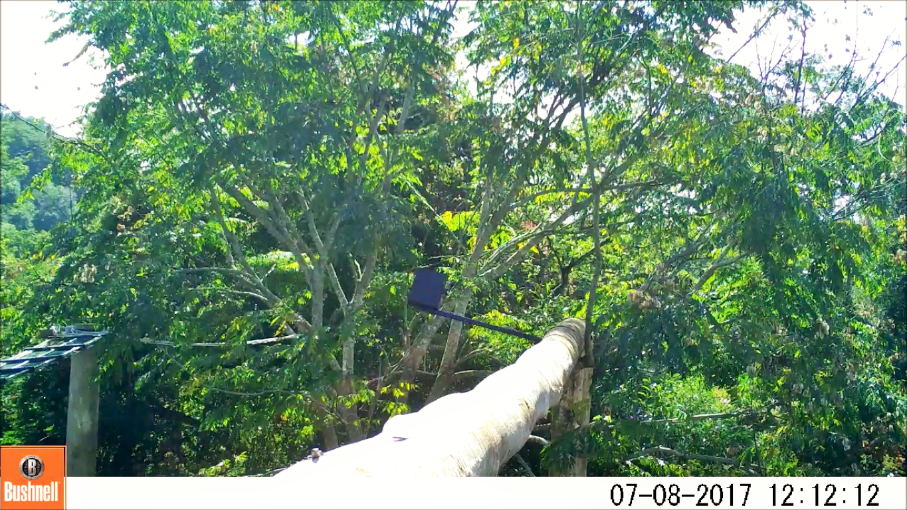

--- 
title: 'WILDCROSSDATA: a dataset on the use of crossing structures in Latin America'
author: Bibiana Terra Dasoler, Ingridi Camboim Franceschi, Diego Varela, Fernanda
  Zimmermann Teixeira, Larissa Donida Biasotto, Larissa Oliveira
  Gonçalves, Rubem Dornas, Andreas Kindel
date: "`r format(Sys.time(), '%d/%b/%Y')`"
documentclass: book
bibliography:
- book.bib
- packages.bib
description: |
  Tutorial para preenchimento das planilhas do datapaper WILDCROSSDATA.
link-citations: yes
---

# Idioma / Idiom {.tabset .tabset-fade .tabset-pills}

## Português

### Sobre

Este tutorial tem como função auxiliar o preenchimento das planilhas. Cada seção na planilha está representada separadamente no tutorial com exemplos e detalhes de algumas informações solicitadas que podem gerar dúvidas durante o preenchimento. 
Buscamos abranger diferentes exemplos, porém, reconhecemos que podem existir outros tipos de estruturas inseridas em diferentes contextos, as quais diferem dos exemplos abordados aqui. Caso haja dúvidas, entre em contato conosco pelo e-mail passagens.fauna@gmail.com.

### Planilha UNDERPASSES

#### Coluna `structure_type`
Exemplos dos tipos de estruturas de travessia (caracterização com base na função primária de implementação).

##### • Bueiro de concreto
Função primária de conectividade hídrica (Figura \@ref(fig:bueiroconcreto)).

```{r bueiroconcreto, echo=FALSE, fig.cap='Bueiro de concreto. Fonte: ©Diego Varela.', fig.align='center', out.width='40%'}
knitr::include_graphics("Imagens/bueiro_concreto.jpg")
```

##### • Bueiro corrugado
Paredes metálicas com ondulações (Figura \@ref(fig:bueirocorrugado)).

```{r bueirocorrugado, echo=FALSE, fig.cap='Bueiro corrugado. Fonte: ©EGR – Empresa Gaúcha de Rodovias.', fig.align='center', out.width='40%'}
knitr::include_graphics("Imagens/bueiro_corrugado.jpg")
```

##### • Bueiro de metal
Paredes metálicas (Figura \@ref(fig:bueirodemetal)).

```{r bueirodemetal, echo=FALSE, fig.cap='Bueiro de metal. Fonte: ©Diego Varela.', fig.align='center', out.width='40%'}
knitr::include_graphics("Imagens/bueiro_metal.jpeg")
```

##### • Bueiro com plataforma seca (bueiro com passadiço)
Função primária de conectividade hídrica, mas com plataforma seca permitindo a travessia da fauna terrestre (Figura \@ref(fig:bueiroplataformaseca)).

```{r bueiroplataformaseca, echo=FALSE, fig.cap='Bueiro com plataforma seca (bueiro com passadiço). Fonte: ©Fernanda Teixeira.', fig.align='center', out.width='40%'}
knitr::include_graphics("Imagens/bueiro_plataforma_seca.jpeg")
```

##### • Passagem de gado
Não possui drenagem de água e sua função primária é a de passagem de gado (Figura \@ref(fig:passagemdegado)).

```{r passagemdegado, echo=FALSE, fig.cap='Passagem de gado. Fonte: ©Diego Varela.', fig.align='center', out.width='40%'}
knitr::include_graphics("Imagens/passagem_de_gado.jpg")
```

##### • Passagem de fauna
Não possui drenagem de água e sua função primária é a de passagem de fauna (Figura \@ref(fig:passagemdefauna)).

```{r passagemdefauna, echo=FALSE, fig.cap='Passagem de fauna. Fonte: ©Diego Varela.', fig.align='center', out.width='40%'}
knitr::include_graphics("Imagens/passagem_de_fauna.jpg")
```

##### • Ponte
Estrutura suspensa por colunas e habitualmente com presença de água (exceto períodos de seca). Exemplos: viadutos, pontilhões, pontes e elevadas (Figura \@ref(fig:ponte)).

```{r ponte, echo=FALSE, fig.cap='Ponte. Fonte: ©EGR – Empresa Gaúcha de Rodovias.', fig.align='center', out.width='40%'}
knitr::include_graphics("Imagens/ponte.JPG")
```

```{r viaduto, echo=FALSE, fig.cap='Viaduto. Fonte: ©Diego Varela.', fig.align='center', out.width='40%'}

```

#### Coluna `structure_cell`
Determinadas estruturas, principalmente as drenagens de água, podem ser formadas por múltiplas estruturas paralelas de mesma função. Essa coluna tem por objetivo informar o número de estruturas paralelas (por analogia, nos exemplos, é contabilizado o número de embocaduras de um dos lados da estrutura). Os exemplos abaixo não esgotam as possibilidades (p. ex. quádrupla (4), quíntupla (5) etc.).

##### • Simples (1)
Estrutura com embocadura única (Figura \@ref(fig:cellssimples)).

```{r cellssimples, echo=FALSE, fig.cap='Passagem simples (embocadura única). Fonte: ©EGR – Empresa Gaúcha de Rodovias.', fig.align='center', out.width='40%'}
knitr::include_graphics("Imagens/cells_simples.jpg")
```

##### • Dupla (2)
Estrutura com duas embocaduras (Figura \@ref(fig:cellsdupla)).

```{r cellsdupla, echo=FALSE, fig.cap='Passagem dupla (duas embocaduras). Fonte: ©EGR – Empresa Gaúcha de Rodovias.', fig.align='center', out.width='45%'}
knitr::include_graphics(c("Imagens/cells_dupla.jpg"))
```

##### • Tripla (3)
Estrutura com três embocaduras (Figura \@ref(fig:cellstripla)).

```{r cellstripla, echo=FALSE, fig.cap='Passagem tripla (três embocaduras). Fonte: ©EGR – Empresa Gaúcha de Rodovias.', fig.align='center', out.width='50%'}
knitr::include_graphics(c("Imagens/cells_tripla.jpg"))
```

#### Coluna `structure_shape`
Determinadas estruturas, principalmente as drenagens de água, costumam ter formatos de embocadura predeterminados, como circular (ou tubular / elíptico), celular (quadrado ou retangular) e em arco.

##### • Celular
Estrutura com perfil de embocadura com ângulos retos (quadrado ou retangular)
 (Figura \@ref(fig:celular)).
 
```{r celular, echo=FALSE, fig.cap='Estrutura celular. Fonte: ©EGR – Empresa Gaúcha de Rodovias.', fig.align='center', out.width='50%'}
knitr::include_graphics(c("Imagens/celular.jpg"))
```

##### • Tubular
Perfil de embocadura circular ou elíptico
 (Figura \@ref(fig:tubular)).
 
```{r tubular, echo=FALSE, fig.cap='Estrutura tubular. Fonte: ©EGR – Empresa Gaúcha de Rodovias.', fig.align='center', out.width='50%'}
knitr::include_graphics(c("Imagens/tubular.jpg"))
```

##### • Arco
Perfil de embocadura circular ou elíptico
 (Figura \@ref(fig:arco)).
 
```{r arco, echo=FALSE, fig.cap='Estrutura em arco. Fonte: ©Fernanda Teixeira.', fig.align='center', out.width='50%'}
knitr::include_graphics(c("Imagens/bueiro_arco.jpeg"))
```

#### Coluna `structure_photo`
Para que possamos compreender todos os diferentes contextos de passagens de fauna e, eventualmente, realizar confirmações sobre os dados disponibilizados, imagens representativas de cada estrutura de travessia devem ser enviadas no mesmo e-mail da planilha de dados, preferencialmente anexadas ou com link para baixar. A proposta dessa foto **não** é o envio de uma imagem capturada pela armadilha fotográfica, mas uma foto tirada externamente exibindo o número de embocaduras (células) e formato da estrutura. Exemplos nesse sentido podem ser encontrados na Figura \@ref(fig:structurephotounder).

```{r structurephotounder, echo=FALSE, fig.cap='Exemplos de fotos a serem enviadas como demonstração da estrutura de travessia.', fig.align='center', out.width='100%'}
knitr::include_graphics(c("Imagens/structure_photo_under.png"))
```

#### Colunas `structure_height`, `structure_width`, `structure_length` e `waterbody_width`

##### • Estruturas convencionais
Valores de mensuração da estrutura devem ser fornecidos, como altura (`structure_height` = **a**), largura (`structure_width` = **b**) e comprimento (`structure_length` = **c**, **c1**, **c2**) da estrutura (Figura \@ref(fig:structuremedidas)).Os valores devem ser informados em **metros**.
Cabe notar que o comprimento pode não ser igual à largura da pista, uma vez que existem estruturas esconsas (**c1**, enviesadas) em relação ao eixo da via ou em estradas com aterro, no qual a estrutura vá além da largura da via e do acostamento (**c2**).

```{r structuremedidas, echo=FALSE, fig.cap='Esquemas para estrutura convencionais exibindo as formas de coleta de parâmetros de altura (**a**), largura (**b**) e comprimento (**c1**, **c2**) da estrutura.', fig.align='center', out.width='80%'}
knitr::include_graphics(c("Imagens/under_medidas.jpg"))
```

##### • Pontes
O sistema de mensuração é diferenciado no caso de pontes.
Valores de mensuração da estrutura devem ser fornecidos, como altura (`structure_height` = **a**), largura (soma) das margens secas (`structure_width` = **b**), extensão (`structure_length` = **c**) e largura do corpo d'água sob a ponte (`waterbody_width` = **d**) da estrutura (Figura \@ref(fig:structuremedidasagua)).Os valores devem ser informados em **metros**.

```{r structuremedidasagua, echo=FALSE, fig.cap="Esquemas para pontes e pontilhões exibindo as formas de coleta de parâmetros de altura (**a**), largura (soma) das margens secas (**b**), comprimento (**c**) e largura do corpo d'água sob a ponte (**d**) de pontes e pontilhões.", fig.align='center', out.width='100%'}
knitr::include_graphics(c("Imagens/ponte_bd.jpg"))
```

### Planilha OVERPASSES
#### Coluna `structure_type`
Nessa seção são apresentados os diferentes tipos de estruturas de travessias superiores.

##### • Pontes flexíveis
São pontes que apresentam material flexível sujeito a oscilações quando o animal está cruzando ou em regiões com ventos. Abaixo segue alguns exemplos.

###### - Ponte flexível em aço (Figura \@ref(fig:flexivelaco)).

```{r flexivelaco, echo=FALSE, fig.cap='Ponte flexível em aço. Fonte: ©Rodosol.', fig.align='center', out.width='40%'}
knitr::include_graphics("Imagens/flexivel_aco.jpg")
```

###### - Ponte flexível em redes (Figura \@ref(fig:flexivelrede)).

```{r flexivelrede, echo=FALSE, fig.cap='Ponte flexível em redes. Fonte: ©Rubem Dornas.', fig.align='center', out.width='40%'}
knitr::include_graphics("Imagens/flexivel_rede.jpg")
```

###### - Ponte flexível de corda (Figura \@ref(fig:flexivelcorda)).

```{r flexivelcorda, echo=FALSE, fig.cap='Ponte flexível de corda. Fonte: ©Rodosol.', fig.align='center', out.width='40%'}
knitr::include_graphics("Imagens/flexivel_corda.jpg")
```

###### - Ponte flexível em túnel
Ponte que normalmente consiste em uma trama de cordas em formato retangular (Figura \@ref(fig:flexiveltunel)).

```{r flexiveltunel, echo=FALSE, fig.cap='Ponte flexível em túnel.', fig.align='center', out.width='40%'}
knitr::include_graphics("Imagens/sem_foto.png")
```

##### • Pontes rígidas
São pontes que apresentam material rígido que não está sujeito a oscilações quando o animal está cruzando ou com presença de ventos. Abaixo segue alguns exemplos.

###### - Ponte rígida com tronco de madeira

```{r rigidamadeira, echo=FALSE, fig.cap='Ponte rígida com tronco de madeira. Fonte: ©Francini Garcia.', fig.align='center', out.width='40%'}

```

###### - Ponte rígida com plataforma metálica

```{r rigidametal, echo=FALSE, fig.cap='Ponte rígida com plataforma metálica. Fonte: ©Helio Secco.', fig.align='center', out.width='40%'}

```

##### • Pontes de vegetação
###### - Ponte de lianas

```{r vegetacaolianas, echo=FALSE, fig.cap='Ponte de lianas.', fig.align='center', out.width='40%'}
knitr::include_graphics("Imagens/sem_foto.png")
```

###### - Ponte de copas
Esse tipo de travessia consiste na conexão ou proximidade entre copas de árvores dos dois lados que se juntam ou ficam próximas o suficiente para permitir o cruzamento do animal sobre a via (Figura \@ref(fig:vegetacaocopas)).

```{r vegetacaocopas, echo=FALSE, fig.cap='Ponte de copas. Fonte: ©Larissa Gonçalves.', fig.align='center', out.width='40%'}
knitr::include_graphics("Imagens/ponte_copas.jpg")
```

##### • Ecoduto
###### - Viaduto vegetado
Viaduto construído especificamente para travessia de fauna, costumeiramente com presença de cobertura de gramíneas e arbustos (Figura \@ref(fig:viadutovegetado)).

```{r viadutovegetado, echo=FALSE, fig.cap='Viaduto vegetado. Fonte: ©Diego Varela.', fig.align='center', out.width='40%'}
knitr::include_graphics("Imagens/viaduto_vegetado.jpg")
```

#### Coluna `structure_branch_access`
Corresponde ao número de ligações implantadas para dar acesso à passagem superior.

```{r structurebranchaccess, echo=FALSE, fig.cap='Ramificações de acesso à passagem superior.', fig.align='center', out.width='40%'}
knitr::include_graphics("Imagens/sem_foto.png")
```

#### Coluna `structure_photo`
Para que possamos compreender todos os diferentes contextos de passagens de fauna e, eventualmente, realizar confirmações sobre os dados disponibilizados, imagens representativas de cada estrutura de travessia devem ser enviadas no mesmo e-mail da planilha de dados, preferencialmente anexadas ou com link para baixar. 
A proposta dessa foto **não** é o envio de uma imagem capturada pela armadilha fotográfica, mas uma foto tirada externamente exibindo o formato da estrutura como no exemplo (Figura \@ref(fig:structurephotoover)).

```{r structurephotoover, echo=FALSE, fig.cap='Exemplo de foto a ser enviada como demonstração da estrutura de travessia. Fonte: ©Diego Varela.', fig.align='center', out.width='40%'}
knitr::include_graphics(c("Imagens/structure_photo_over.jpg"))
```

#### Colunas `structure_height`, `structure_length`, `structure_width` e `structure_internal_height`
Valores de mensuração da estrutura devem ser fornecidos, como altura (`structure_height` = **a**), largura (`structure_width` = **b**), comprimento (`structure_length` = **c**) e altura interna da estrutura (caso se aplique) (`structure_internal_height` = **d**) (Figura \@ref(fig:structuremedidasover)).Os valores devem ser informados em **metros**.
Cabe notar que o comprimento pode **não ser** igual à largura da pista, uma vez os pilares de sustentação das passagens superiores costumam se distanciar da via sendo implantadas na faixa de domínio.

```{r structuremedidasover, echo=FALSE, fig.cap='Esquemas para determinação de medidas de parâmetros de altura (**a**), comprimento (**b**), largura (**c**) e altura interna (**d**) da estrutura.', fig.align='center', out.width='40%'}
knitr::include_graphics(c("Imagens/over_medidas2.jpg"))
```

### Planilha FENCING
#### Colunas `fence_length`
Esses campos devem ser preenchidos com a extensão da cerca, de acordo com os 4 lados adjacentes à embocadura da passagem, nomeados como **A1**, **A2**, **B1** e **B2** (Figura \@ref(fig:fencelength)).

```{r fencelength, echo=FALSE, fig.cap='Exemplo da extensão da cerca de ambos os lados da embocadura da estrutura de travessia e também de ambos os lados da infraestrutura linear.', fig.align='center', out.width='80%'}
knitr::include_graphics(c("Imagens/fence_length2.jpg"))
```

#### Coluna `fence_overhang`
As cercas direcionadoras podem possuir ou não algum tipo de aba superior à sua estrutura, normalmente planejado de acordo com a fauna a ser barrada.

##### • Cerca com aba ausente
O tipo de cerca mais comum, sem abas (Figura \@ref(fig:cercasemaba)).

```{r cercasemaba, echo=FALSE, fig.cap='Cerca com aba ausente.', fig.align='center', out.width='50%'}
knitr::include_graphics(c("Imagens/cerca_aba_ausente.png"))
```

##### • Cerca com aba angulada rígida
Cerca cuja aba superior é angulada, em material rígido, normalmente angulada para fora da via (Figura \@ref(fig:cercaabarigida)).

```{r cercaabarigida, echo=FALSE, fig.cap='Cerca com aba angulada rígida.', fig.align='center', out.width='50%'}
knitr::include_graphics(c("Imagens/cerca_aba_rigida.png"))
```

##### • Cerca com aba dobrada flexível
A cerca com aba superior dobrada flexível possui material de menor rigidez, visando ceder com o peso do animal (Figura \@ref(fig:cercaflexivel)).

```{r cercaflexivel, echo=FALSE, fig.cap='Cerca com aba dobrada flexível.', fig.align='center', out.width='50%'}
knitr::include_graphics(c("Imagens/cerca_flexivel.png"))
```

##### • Cerca com aba rolete ou similar
Cerca em que a aba é em formato de rolo, que gira quando um animal se escora sobre ela (Figura \@ref(fig:cercarolete)).

```{r cercarolete, echo=FALSE, fig.cap='Cerca com aba rolete.', fig.align='center', out.width='50%'}
knitr::include_graphics(c("Imagens/cerca_rolete.png"))
```

#### Coluna `fence_conservation`
Qualquer possibilidade de acesso a via a cerca é considerada não integra, pois perde a função de bloqueio de acesso a via. Abaixo segue exemplos de conservação das cercas.

##### • Cerca íntegra 
A cerca **não** apresenta buracos, defeitos ou irregularidades (Figura \@ref(fig:cercaintegra)).

```{r cercaintegra, echo=FALSE, fig.cap='Exemplo de cerca íntegra. Fonte: ©Fernanda Teixeira.', fig.align='center', out.width='50%'}
knitr::include_graphics(c("Imagens/cerca_integra.jpeg"))
```

##### • Cerca não íntegra
A cerca apresenta buracos e/ou defeitos (Figura \@ref(fig:cercanaointegra)).

```{r cercanaointegra, echo=FALSE, fig.cap='Exemplo de cerca não íntegra. Fonte: ©Fernanda Teixeira.', fig.align='center', out.width='50%'}
knitr::include_graphics(c("Imagens/cerca_nao_integra.jpeg"))
```

### Planilha CAMERA TRAP
#### Colunas `camera_position`
Exemplos da posição da armadilha fotográfica em relação à estrutura de travessia.

##### • Posição interna borda
A câmera está poscionada na borda interna da estrutura de travessia (Figura \@ref(fig:internaborda)).

```{r internaborda, echo=FALSE, fig.cap=' Câmera com posição interna borda. Fonte: ©EGR - Empresa Gaúcha de Rodovias.', fig.align='center', out.width='50%'}
knitr::include_graphics(c("Imagens/camera_position_interna_borda.jpg"))
```

##### • Posição interna central
A câmera está poscionada dentro da estrutura de travessia, na parte central (Figura \@ref(fig:internacentral)).

```{r internacentral, echo=FALSE, fig.cap='Câmera com posição interna central. Fonte: ©EGR - Empresa Gaúcha de Rodovias.', fig.align='center', out.width='50%'}
knitr::include_graphics(c("Imagens/camera_position_interna_central.jpg"))
```

##### • Posição externa
A câmera está poscionada externamente, fora da estrutura de travessia (Figura \@ref(fig:externa)).
```{r externa, echo=FALSE, fig.cap='Câmera com posição externa. Fonte: ©EGR - Empresa Gaúcha de Rodovias.', fig.align='center', out.width='50%'}
knitr::include_graphics(c("Imagens/camera_position_externa.jpg"))
```

#### Colunas `camera_view`
Exemplos da visão da armadilha fotográfica em relação à estrutura de travessia.

##### • Câmera com visão para embocadura da estrutura
A visão da câmera está focada na embocadura da estrutura de travessia (Figura \@ref(fig:cameravisaoabertura)).

```{r cameravisaoabertura, echo=FALSE, fig.cap='Câmera com visão para abertura da estrutura. Fonte: ©EGR - Empresa Gaúcha de Rodovias.', fig.align='center', out.width='50%'}
knitr::include_graphics(c("Imagens/camera_visao_abertura.jpg"))
```

##### • Câmera com visão para o interior da estrutura
A visão da câmera está focada no interior da estrutura de travessia (Figura \@ref(fig:cameravisaointerior)).

```{r cameravisaointerior, echo=FALSE, fig.cap='Câmera com visão para o interior da estrutura. Fonte: ©Diego Varela.', fig.align='center', out.width='50%'}
knitr::include_graphics(c("Imagens/camera_visao_interior.jpg"))
```

#### Colunas `camera_vision_photo`
Exemplos de fotos obtidas com cada armadilha fotográfica para visualização do ambiente a serem
preenchidas neste campo.
**As imagens devem ser anexadas e enviadas no mesmo e mail de planilha de dados!**

```{r cameravisionphoto, echo=FALSE, fig.cap='Exemplos de imagens com a visão da câmera para serem enviadas. Fonte: ©Diego Varela.', fig.align='center', out.width='90%'}
knitr::include_graphics(c("Imagens/camera_vision_photo.jpg"))
```

#### Colunas `Behavior`
Exemplos dos comportamentos dos animais em relação à estrutura de travessia considerados.

#### • Dentro
O animal está dentro da estrutura de travessia (Figura \@ref(fig:dentro)).

```{r dentro, echo=FALSE, fig.cap='O animal está dentro da estrutura de travessia. Fonte: ©.', fig.align='center', out.width='50%'}
knitr::include_graphics(c("Imagens/behavior_dentro.jpg"))
```

#### • Entrando
O animal parece estar entrando dentro da estrutura de travessia (Figura \@ref(fig:entrando)).

```{r entrando, echo=FALSE, fig.cap='O animal está entrando na estrutura de travessia. Fonte: ©EGR - Empresa Gaúcha de Rodovias.', fig.align='center', out.width='50%'}
knitr::include_graphics(c("Imagens/behavior_entrando.jpg"))
```

#### • Saindo
O animal parece estar saindo de dentro da estrutura de travessia (Figura \@ref(fig:saindo)).

```{r saindo, echo=FALSE, fig.cap='O animal está saindo da estrutura de travessia. Fonte: ©EGR - Empresa Gaúcha de Rodovias.', fig.align='center', out.width='50%'}
knitr::include_graphics(c("Imagens/behavior_saindo.jpg"))
```

#### • Arredores
Quando não for classificado em nenhuma outra categoria, mas o animal estava próximo a passagem (Figura \@ref(fig:arredores)).

```{r arredores, echo=FALSE, fig.cap='O animal está próximo da estrutura de travessia. Fonte: ©EGR - Empresa Gaúcha de Rodovias.', fig.align='center', out.width='50%'}
knitr::include_graphics(c("Imagens/behavior_arredores.jpg"))
```

#### • Evitando
Vídeo ou fotos em sequência que confirmam que o animal desistiu de entrar na estrutura de travessia (Figura \@ref(fig:evitando)).

```{r evitando, echo=FALSE, fig.cap='Exemplo de animal evitando/desistindo de entrar na estrutura de travessia.', fig.align='center', out.width='40%'}
knitr::include_graphics("Imagens/sem_foto.png")
```
***

```{r include=FALSE}
# automatically create a bib database for R packages
knitr::write_bib(c(
  .packages(), 'bookdown', 'knitr', 'rmarkdown'
), 'packages.bib')
```


## English
### About

## Español
### Sobre
